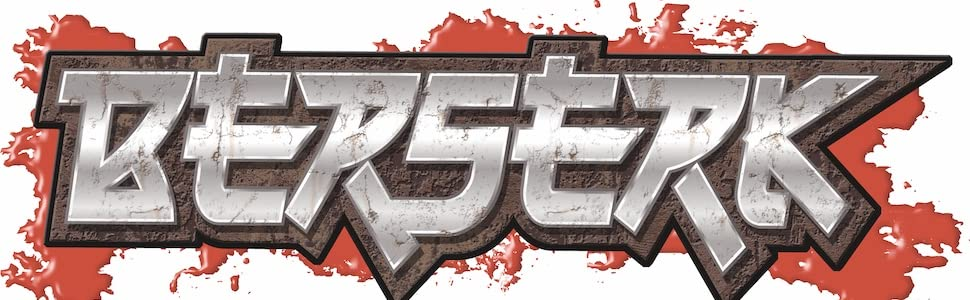
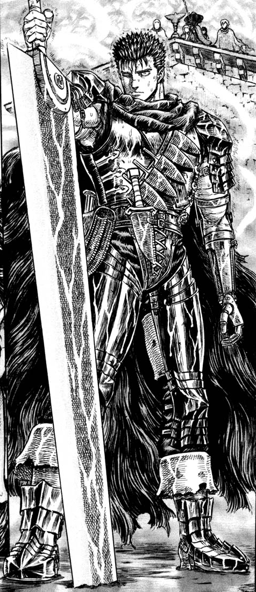
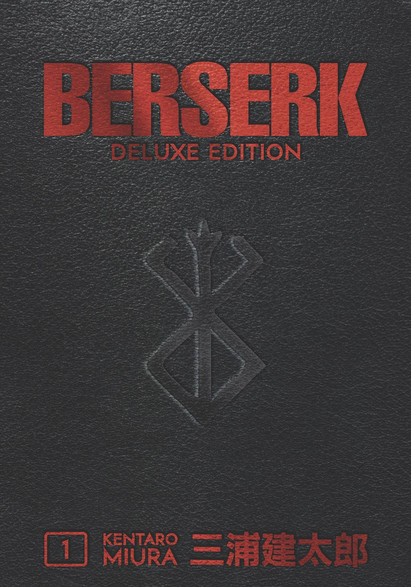

Fantasy media isn't just limited to the western world and has done very well in countries such as Japan. One such piece of media that jumps out immediately from the rest of the crowd is the manga Berserk, created and illustrated by Kentaro Miura. 

Its take on dark fantasy has sent ripples through the genre for years to come and has become a cult classic. Because of this each edition of the manga has to have iconic and memorable iconography that reflects the content as well, especially the protagonist. With such as prominent and well done main character it is no wonder that the designers didn't want to lose that when it came to the designs of the physical mangas. With two main types of the manga there have been two main instances of the typography and so first we shall look at the single volume style. 

This style has a novelty side to it by addding a metallic texture to the font and including blood splatters in the background. There is limited use of serif and instead a low descender line that really emphasises the ends of the letters jutting out. With the metallic shine and shape the lettering looks sharp but brutal. Those that are fans of such a thing would already be interested because of this and would be drawn in. The designers have done a good job of presenting the medieval fantasy elements with this look as well as representing the protagonist's brutalistic nature along with his choice of weapon.

In this case then, any potential reader would gather the tone and themes seen in Berserk and it would help them make their decision as to whether they'll make the purchase and invest their time in the story.  On the other hand, there is another main English edition of the manga, The Deluxe Edition. With the deluxe editions of the manga the typography changes to still reflect the brutal nature of the content, whilst bringing in a new air of difference and exclusivity. The fill colour also changes to completely red which shows up well on the fake, black leather covers. The font loses the novelty but instead stays brutalistic and blunt in style. 

As well as this, the mangaka's (author) name is at the bottom of the cover and is not in a serif. It is clear against the black and draws in current fans who associate the work of fantasy with him quite heavily. The use of red also draws in the emotions of rage, passion and anger as well as representing blood. These are all what one would be able to associate with the manga, so despite the simplicity relative to the previous title it is affective in displaying everything about Berserk.