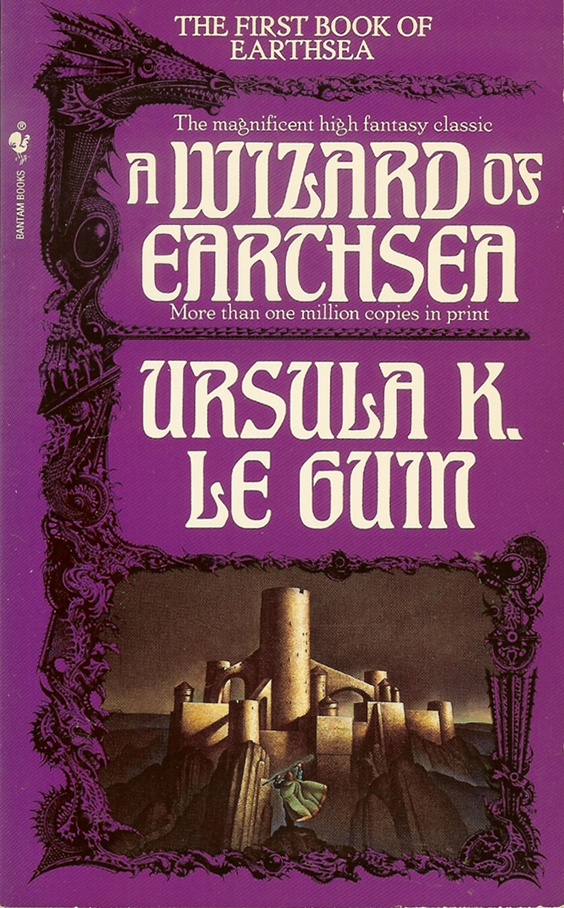

Fonts have made their mark across the whole world and have brought in associations and preconceptions on the texts they form. In terms of fantasy there are many fonts that have made an impact on the genre and are seen throughout publications, especially their covers. 

First of all there are those fonts that aren't so far removed from what one may expect from a usual publication , such as educational. George R.R. Martin's 'A Song of Ice and Fire' can again be pulled in as an example of such fonts. What seems to be employed is a slightly modified version of Trajan Pro in the cover for both the author's name and the book title, a serif font. 

It is modified in the sense that there are instances of serif flourishes being used on letters and in places on them that are not typical to the original Trajan Pro. This can be observed specifically on the upper case N in which uses serif on both its end points normally, but as seen on 'A Song of Ice and Fire' has a serif flourish on the middle point too. 

A more flamboyant and "flashy" use of font can be seen in the 'Earthsea' trilogy by Ursula K. Le Guin, specifically its Bantam Books edition. There we can see its use of what appears to be Hohenzollern, a font that doesn't have sharp, pointed serif but instead duller points that are at the end of looped lettering. The subtitling takes a step back from this whimsical feeling and instead goes with a more straight forward use of the Artcraft font to give off key subtitling and information.

The imagery and the typography of the book cover flow well together and as a whole create this imagery of mystery and possibly power. Magic obviously being a key point when looking at the cover is well conveyed by the use of Hohenzollern due to its runic/handwritten nature, as if written by a wise wizard.

Another and final example is that of the Percy Jackson covers. They employ a rather unique looking font called windlass. Again it is a base font that has been modified in order to add that more fantastical element to reflect  the content. In this case the almost runic presentation of the lettering reflects the content in the books well as they are reminiscent of the typography used by Greeks and Romans to an extent. 

 There is the novelty aspect of the typography as seen in the O of 'Jackson' reflecting the character and his connection to the Greek god Poseiden. As well as this the novelty aspect of the typography extends to the