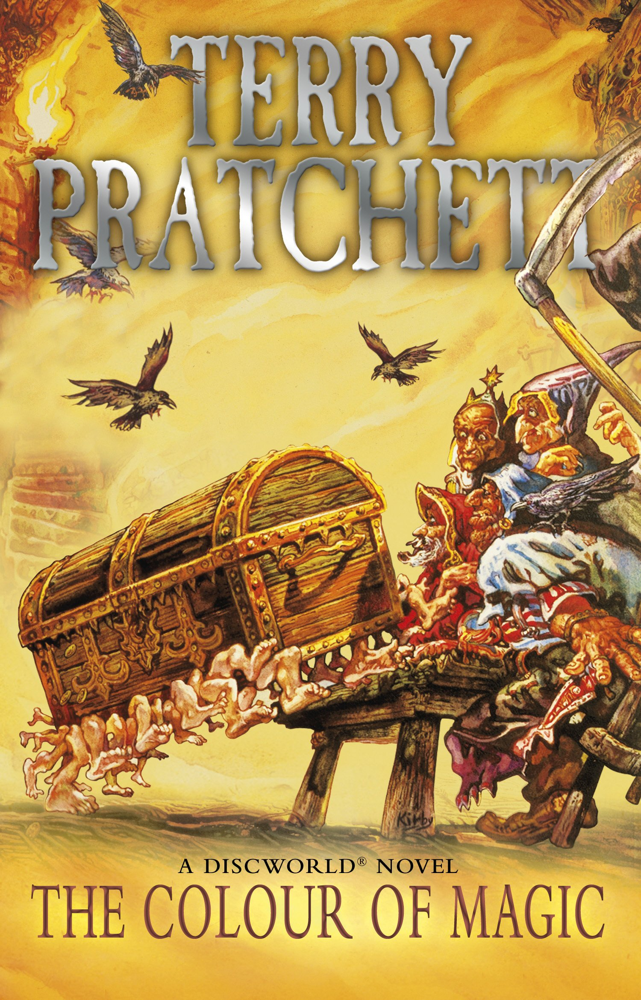

Typography also encompasses what type of colours are used within the lettering, helping convey certain emotions by drawing on already established sociatal implications. On first observation one can pick up on certain trends such as the use of silver and/or gold on many fantasy book covers.

The colours are associated with an unflinching and pure clearness that goes hand in hand with richness. The colours also extend to significance in other cultures than just in the west, specifically China in which the significance of gold and silver is shown throughout their culture. In ancient China alchemical traditions saw the belief that drinking an elixir made from gold would equal immortality. 

In terms of typography and colour in print media, traditions depicting gold as significant and rich means that one can see wonder and amazement in the colour choice on book covers. As the inspiration of this post's title, Terry Pratchett's 'The Colour of Magic' is taking the forefront of this study. Like many works written by famous author's, the cover takes Pratchett's name as the front and centre (well top) of the cover and uses its unique typography on it. 

The use of silver with a metallic finish links it in with the world that Pratchett has created (the famous Discworld) and as stated above can excite the potential reader with their inherent understanding of silver and its promise of something magical. Using such a colour on the author's name also yields a great reaction, solidifying his name as legendary, the master of a series of books enjoyed by so many. In this release of the books as well the typography is incorporated into the rest of the scene and practically interacts with the rest of the characters presented. This conveys it as if 'Terry Ptratchett' really is suspended above the scene and forged from silver.

Apart from silver and gold to portray the magical nature of certain works of fiction, red is also used a lot throughout fantasy, especially amongst those more associated with dark fantasy and violence. A prime example is 'Blood Ninja' by Nick Lake. The typography itself contains sharp serif that also has a blockier body, an attempt to reflect the anicent Japanese setting of the book. The choice of red is an obvious nod to the focus on vampirism and bloodlust. Red being associated with lust and violence, the potential reader already seeing